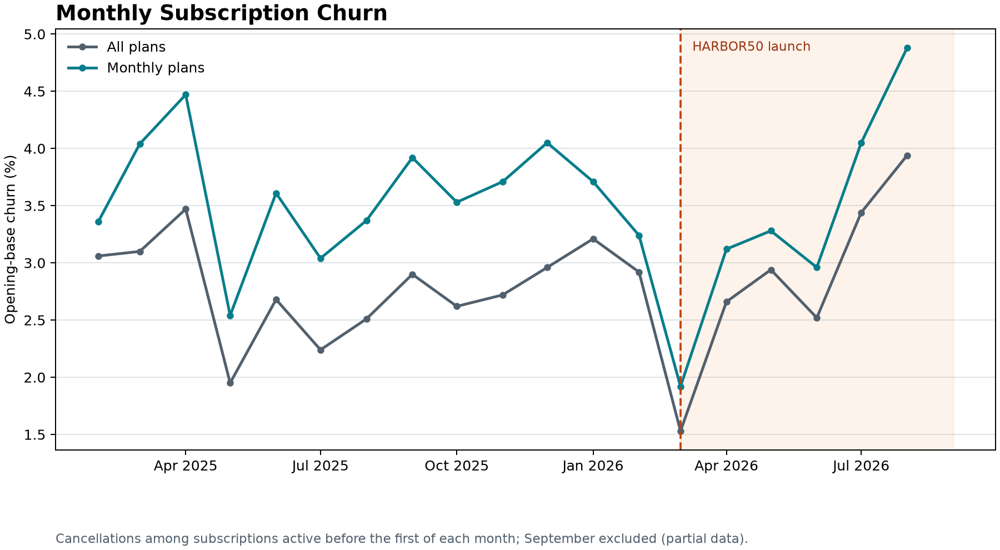
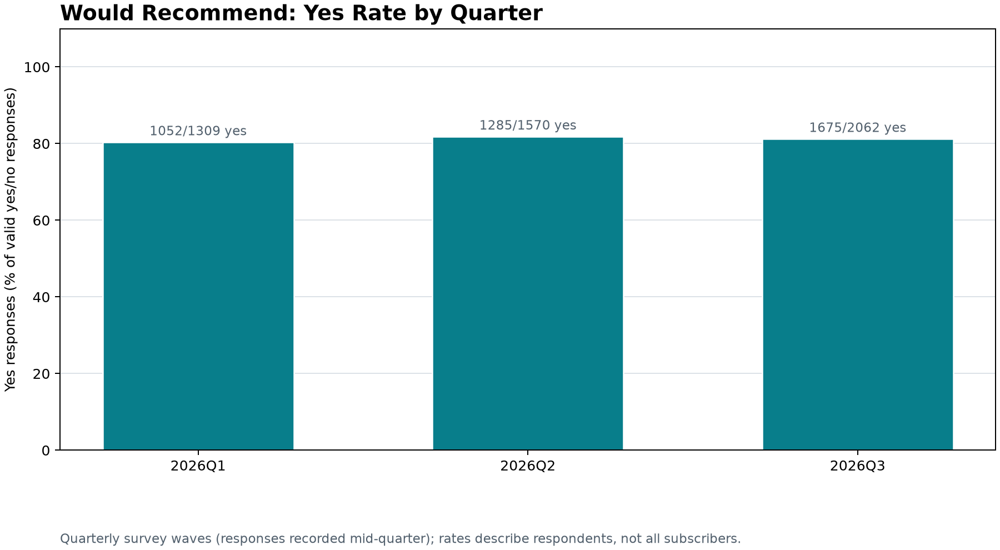
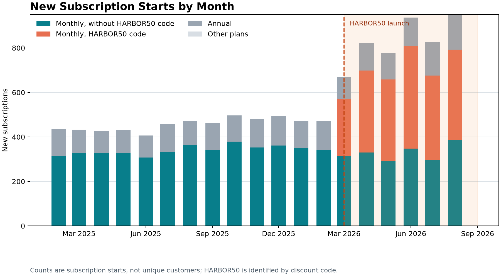

# Harbor Churn Review

**To:** Dana Whitfield, VP Operations  
**Subject:** August churn increase and HARBOR50  
**Data through:** September 15, 2026

## Recommendation

The available data supports a real increase in subscription churn from June to August, but the reported 2.7% and 5% are not directly comparable without their metric definitions. Using a strict opening-base definition, all-plan churn rose from **2.44% in June (171 / 7,020)** to **3.82% in August (318 / 8,314)**. For monthly subscriptions alone, it rose from **2.85% (149 / 5,234)** to **4.75% (299 / 6,300)**. September is excluded because the export is only through September 15.

I would **not cancel HARBOR50 based on this extract alone**. Among May paid-social monthly subscribers with a full 90-day observation window, retention was **94.4% for confirmed HARBOR50 code users (321 / 340)** versus **87.0% for likely campaign-exposed signups without the code (47 / 54)**. The latter group is inferred from post-launch start date and paid-social channel; it is not a confirmed non-promo group. This is descriptive evidence, not a causal estimate: offer assignment was not randomized, comparison samples are much smaller, and the 90-day point may not capture behavior after the discount ends. Continue only with a defined measurement plan and a short review checkpoint after post-promotion renewals are observable.

## What the headline rates may mean

The dataset gets close to both headlines using **all valid cancellations during the month divided by the opening base**: June is **2.65% (186 / 7,020)** for all plans, while August is **5.05% (318 / 6,300)** for monthly plans. Under the stricter opening-cohort numerator, the comparable rates are 2.44% and 4.75%, respectively. These are plausible bridges, not proof of Finance's or the board's actual formulas. The teams' definitions and source queries should be reconciled before either headline is used as the official trend.

The primary comparable rate above counts cancellations during the month only among subscriptions active at the month's start. This avoids putting mid-month starts in the numerator when they were not in the opening denominator. A second column shows all in-month cancellations divided by the opening base to compare with the headline figures transparently.

For a tenure-matched year-over-year check, the pooled March–May monthly-subscription cohorts retained **89.9% at day 90 in 2025 (885 / 984)** and **91.9% in 2026 (1,763 / 1,918)**. This does not support a simple claim that newer customers are inherently retaining worse, but acquisition mix changed substantially and the pooled result is not a causal comparison. The SQL output also provides channel-level matched rates. At the September 15 cutoff, June 2026 cohorts have not all reached day 90, so a June 90-day comparison is not reported.

## Quarterly survey signal

The survey file contains three response waves, recorded mid-quarter rather than on the first day: January 15–24, April 15–24, and July 15–24. Among valid yes/no responses, the share answering yes was:

| Quarter | Yes responses | Valid responses | Yes rate |
| --- | ---: | ---: | ---: |
| 2026 Q1 | 1,052 | 1,309 | 80.4% |
| 2026 Q2 | 1,285 | 1,570 | 81.8% |
| 2026 Q3 | 1,675 | 2,062 | 81.2% |

These percentages describe respondents in each wave, not the full subscriber base.

## Promotion-era subscription volume

Monthly starts increased materially versus the same calendar month in 2025. The HARBOR50 column counts subscriptions with the code, not estimated incremental conversions.

| Month | 2025 monthly starts | 2026 monthly starts | Change vs. 2025 | HARBOR50-coded starts |
| --- | ---: | ---: | ---: | ---: |
| March | 329 | 569 | +240 | 254 |
| April | 329 | 698 | +369 | 368 |
| May | 326 | 658 | +332 | 367 |
| June | 308 | 807 | +499 | 460 |
| July | 334 | 676 | +342 | 379 |
| August | 364 | 792 | +428 | 406 |

These are observed year-over-year differences, not a causal estimate of added subscriptions. Meta spend rose sharply at the same time, and this dataset has neither a holdout nor campaign-level attribution; some code users may have subscribed without the discount.

## Complimentary subscriptions and churn segments

COMP100 does **not** explain the June-to-August churn rise. Excluding complimentary subscriptions changes all-plan opening-cohort churn from **2.44% to 2.45% in June** and **3.82% to 3.84% in August**. For monthly subscriptions, it changes the rates from **2.85% to 2.87%** and **4.75% to 4.77%**, respectively. There were 34–35 COMP100 subscriptions in the monthly opening bases in those months, with no COMP100 opening-cohort cancellations in either month. The full sensitivity, including denominators, is in `outputs/comp100_churn_sensitivity.csv`.

Among monthly subscriptions excluding COMP100, churn rose across **every age band and region** between June and August. The largest age-band rate increase was for ages 45–54 (**2.53% to 5.14%, +2.61 percentage points**); the largest regional increase was in the Southwest (**2.18% to 5.42%, +3.23 points**). The increase is broad, not isolated to one segment. Counts and opening denominators are in `outputs/churn_by_age_region.csv`; these are unadjusted descriptive cuts, not evidence that age or region caused the change.

## Charts

## HARBOR50 interpretation

The promotion output distinguishes **Confirmed HARBOR50** (discount code), **Likely paid-social campaign** (monthly subscription starting on/after launch, paid-social channel, no code), and other post-launch monthly subscriptions. It provides all-channel totals plus channel-level cuts by start month and equal 30/60/90-day windows. This avoids asserting that channel and timing prove promotion use. The May 90-day paid-social comparison is encouraging but has only 54 likely campaign-exposed subscriptions without the code, and the offer was not randomly assigned. Recent cohorts have not all reached 90 days. The supplied data also does not establish whether customers remain after the promotional price ends.

I recommend keeping the decision open rather than making an irreversible stop/go call. Track 120- and 180-day retention, renewal after the discount period, realized revenue/refunds, and acquisition cost. If feasible, use a randomized holdout or staged offer test, with a pre-agreed retention and contribution-margin threshold.

## Post-promotion cancellations

Using `start_date + 3 calendar months` as the assumed first full-price billing date, confirmed HARBOR50 subscribers show a clear descriptive rise around expiry. The March start cohort went from **2.1% (5 / 238 at risk)** in the 30 days before expiry to **13.3% (31 / 233)** in the next 30 days. April went from **2.6% (9 / 351)** to **12.6% (43 / 342)**. The following 30-day window also remains elevated for these cohorts: **20.8% (42 / 202)** for March and **17.8% (29 / 163)** for April.

This is a signal to investigate, not proof that the discount expiry caused the cancellations. Paid-social monthly subscribers without the code show a similar, smaller-sample increase in the first 30 days after the corresponding three-month date: **3.6% to 11.1%** for March (**1 / 28** to **3 / 27**) and **8.6% to 12.5%** for April (**3 / 35** to **4 / 32**). The rise may reflect a broader paid-social or month-four retention issue. The campaign-exposed comparison groups are small, the no-code group is only inferred, and the date-only files cannot distinguish a cancellation request from service end or billing stop. See `outputs/post_promotion_cancellations.csv` for risk-set counts and later windows.

## Revenue scenarios and profit limits

At the listed **$59 monthly price**, a 50% discount reduces each promotional invoice by **$29.50**. The maximum three-invoice concession is **$88.50 per subscriber** before accounting for early cancellations. Under constant monthly churn scenarios of 3%, 5%, and 8%, the SQL model estimates an expected promotional-period concession of **$85.87, $84.15, and $81.61**, respectively. It estimates the next 12 months of full-price billings at **$549.53, $465.02, and $363.14** per acquired subscriber. Those post-promotion gross billings are about **6.4x, 5.5x, and 4.5x** the expected concession, respectively.

| Assumed monthly churn | Next 12 months at full price | Expected discount concession | Promoted 15-month gross billings | Full-price 15-month comparator |
| ---: | ---: | ---: | ---: | ---: |
| 3% | $549.53 | $85.87 | $635.40 | $721.27 |
| 5% | $465.02 | $84.15 | $549.17 | $633.32 |
| 8% | $363.14 | $81.61 | $444.75 | $526.36 |

These are scenario estimates, not observed revenue or profit. The model assumes monthly invoices at signup and each monthly anniversary, a constant churn hazard across the 15-month projection, three discounted invoices for subscribers still active, then full-price invoices. It excludes refunds, taxes, payment failures, variable service/support costs, and customer-level campaign attribution. Before early churn, 1.5 full-price $59 invoices equal the maximum $88.50 concession.

The data does include total monthly channel spend. For example, Meta Ads spend is **$189,111 in March, $307,652 in April, and $315,527 in May 2026**, alongside paid-social subscription starts in `outputs/marketing_spend_context.csv`. This is total channel spend, not HARBOR50 campaign spend, so dividing it by code users would not be a defensible CAC.

Actual contribution profit per subscription cannot be calculated from the supplied files. The needed calculation is expected billed revenue minus payment/refund costs, variable service costs, and attributable acquisition cost. A break-even CAC can be estimated only after those costs and incremental conversions are known; gross subscription revenue alone is not profit.

# Appendix

## Definitions and assumptions

- **Grain:** subscription, because `subscriptions.csv` has one row per subscription and some customers have multiple subscriptions. This is not customer/logo churn.
- **Opening base:** subscriptions with `start_date` strictly before the first of the month and no cancellation date on or before that date. A start or cancellation dated on the first is excluded from the opening snapshot.
- **Opening-cohort churn:** valid cancellations strictly after the first and before the next month's first, among opening subscriptions, divided by opening subscriptions. Cancellation dates before the start date are excluded as invalid. Because dates have no times, same-day ordering cannot be recovered; this convention avoids counting events on the snapshot boundary.
- **Tenure retention:** a subscription is retained at a checkpoint if its cancellation date is null or later than the checkpoint date. Only subscriptions whose checkpoint falls on or before September 15 are included.
- **Cohort date:** subscription `start_date`, not customer `signup_date`.
- **Promotion comparison:** monthly subscriptions starting on or after March 1. `HARBOR50` is confirmed via `discount_code`; post-launch paid-social subscriptions without a code are labeled likely campaign exposure, not confirmed offer users or non-users. Channel aliases are normalized for grouping. Results are observational, not causal.
- **Complimentary subscriptions:** `COMP100` rows are kept separate from paid comparison groups. Churn sensitivity is reported both including and excluding them; HARBOR50 discounted subscribers remain in the paid population.
- **Age/region segment comparison:** June and August 2026 monthly-plan opening-base churn, excluding COMP100 and retaining HARBOR50, reported with each segment's denominators. No multivariable adjustment is applied.
- **Year-over-year comparison:** monthly subscription cohorts from March through August, grouped by calendar month and channel, with 30/60/90-day rates only when every start date in that month could have reached the checkpoint by September 15. The 2026 90-day comparison therefore currently covers March through May.
- **Post-promotion windows:** expiry is approximated as three calendar months after `start_date`; cancellation hazards use 30-day intervals before/after that date and only subscribers still at risk at each interval's start. Full windows must end by September 15.
- **Revenue scenarios:** monthly churn is held constant at 3%, 5%, or 8% over 15 invoice months. The first three invoice months are modeled at half price, with up to 12 subsequent invoices at list price. These are gross billing scenarios, not profit or an experiment-based incremental lift.
- **Partial periods:** January 2025 is omitted from the monthly churn trend because the file starts at the beginning of the dataset and its opening base is incomplete. September 2026 is omitted because the export ends September 15.

## Data quality and limitations

- The files contain **11,461 customers** and **11,681 subscriptions**, with no duplicate customer or subscription IDs and no unmatched subscriptions in the customer join.
- **25 subscriptions** have cancellation dates before their start dates; these records are excluded from cancellation-event and tenure-retention calculations.
- There are **120 COMP100 monthly subscriptions**; 83 have `status = canceled`, and 38 have no cancellation date. COMP100 represents 34–35 subscriptions in the June/August monthly opening bases and has no opening-cohort cancellations in those two months, so excluding it barely changes headline churn.
- **72 subscriptions** are marked `canceled` but have no cancellation date; none of the `active` subscriptions have a cancellation date. Their historical cancellation timing cannot be reconstructed from these files, so date-based churn may be incomplete. The analysis uses `cancel_date` for events and does not treat current status as a historical event date.
- **192 customers** have a missing acquisition channel. They remain in overall metrics and are grouped as `Unknown` in the channel analysis.
- **220 customers** have multiple subscription rows. Subscription-level churn intentionally counts each subscription separately.
- Survey responses are not used to infer overall satisfaction or churn because response timing and selection may not represent all subscribers.
- Marketing spend is aggregated by channel and month; it cannot be joined to individual customers for causal acquisition or return-on-ad-spend estimates.

## Questions for Dana and Finance

1. Are the June and August headline metrics subscription churn or customer churn? Which plans are included?
2. What exact numerator, opening denominator, date boundaries, and status/cancellation fields are used in the board deck, Finance close, and retention dashboard?
3. Does a cancellation date represent the request date, service end date, or billing stop date? How should same-day start/cancel events be treated?
4. Why do 72 subscriptions have `status = canceled` but no `cancel_date`, and can the missing event dates be recovered?
5. Should COMP100 subscriptions be included in the company's paid churn KPI, and can dates be recovered for complimentary subscriptions with missing cancellation dates?
6. What are the expected post-discount price and renewal behavior for HARBOR50, and what retention or contribution-margin threshold would justify stopping it?
7. Can the next promotion wave include a randomized holdout or phased rollout?

## Reproducibility and AI disclosure

From this folder, install the dependencies with `py -m pip install -r requirements.txt`, then run `py create_charts.py`. This runs [analysis.sql](analysis.sql) through `run_analysis.py`, regenerates the CSV outputs, and creates the three PNGs under `outputs/charts/`. The script reads the raw survey CSV directly and saves its quarterly summary under `outputs/quarterly_survey_recommendation.csv`.

AI helped structure the analysis and identify metric and data-quality edge cases. I executed the SQL locally and checked the reported row counts, June/August numerators and denominators, and cohort rates against the supplied CSVs. Before submitting, confirm this wording accurately describes your own review and any additional checks you perform.